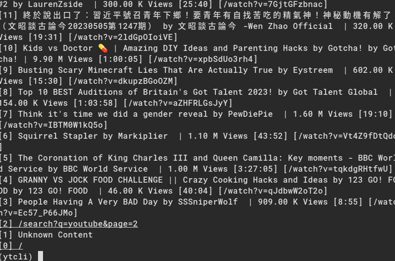

# ytcli

Minimal youtube browser for the command line.

Execute `ytcli` and type `help` for more info.

## Building

Install `rustup` and compile for your platform:

`$ cargo build --release`

## Features

* Query content from random Invidious instances (videos, playlists, channels, navigation)
* Follow Navigation, open playlists and channels
* Watch videos using mpv or vlc
* Download content using yt-dlp